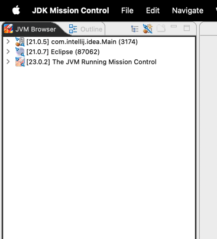
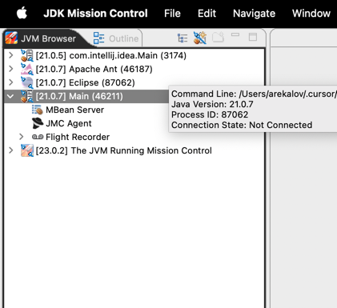
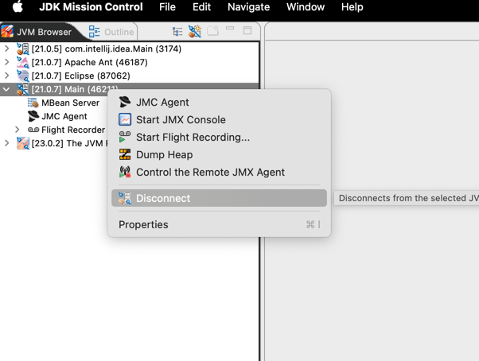
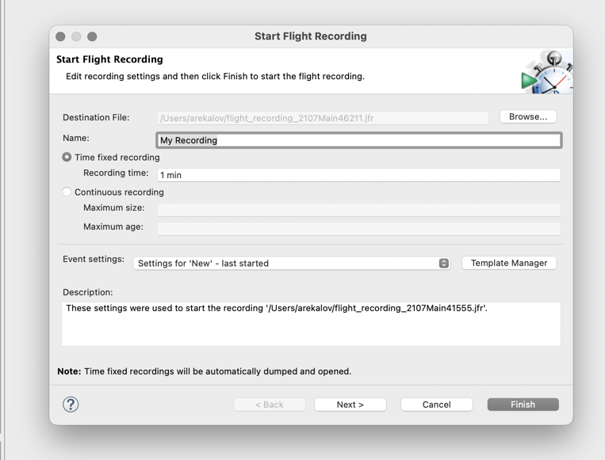
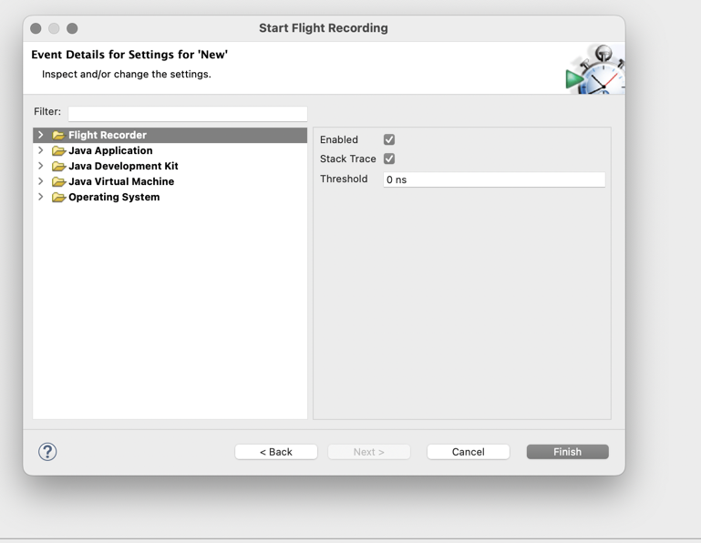
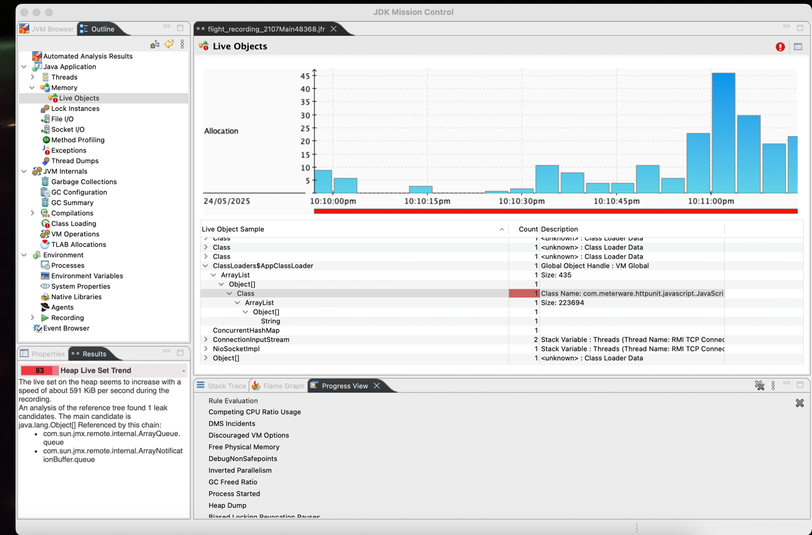
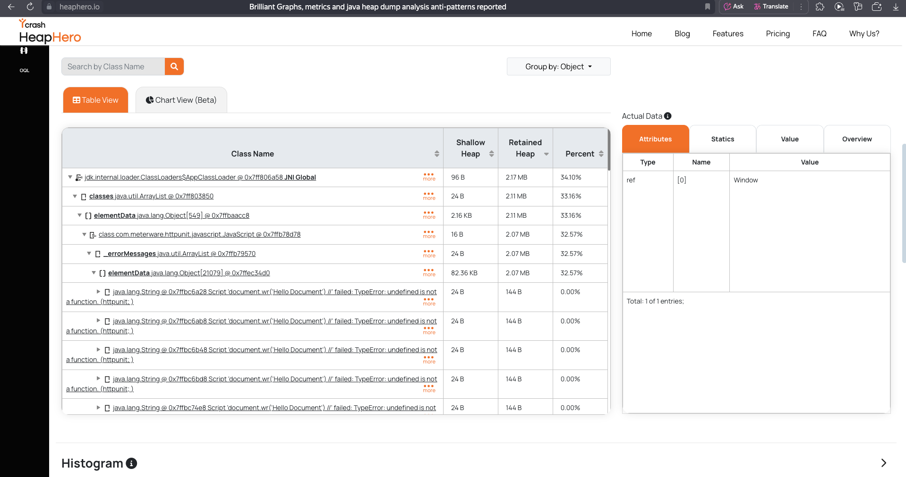

1. Собираем
    ```bash
        ant compile
    ```
2. Запускаем
    ```bash
        ant run
    ```

### Снятие и анализ jfr
1. Открыть jmc, вкладка JVM Browser.
   
2. Выставить большой размер кучи, чтобы программа точно не упала с OOM, например `-Xmx100m` в project.properties `run.jvmargs`.
3. Собрать и запустить программу.
4. Найти нужный процесс в JMC
   
5. ПКМ по процессу, `start flight recording`
   
6. Ничего не меняем, нажимаем next
   
7. Проверяем, чтобы все пункты были включены (если нет - ставим enabled)
   
8. Ждем одну минуту пока пройдет запись jfr.
9. Открываем jfr файл, переходим в раздел `Memory -> Live Objects`
10. Находим класс лоадеры и по стеку можем найти путь до файла с проблемой
    


### Анализ дампа памяти в момент OOM (поиск конкретного места утечки)
1. Выставить маленький размер кучи, например `-Xmx5m` в project.properties `run.jvmargs`.
2. Собрать и запустить программу.
3. В директории detection появится дамп heapdump.hprof.
4. Проанализировать его с помощью любого анализатора дампа, например по ссылке ниже.
5. В largest objects будет объект класслоадера, который занимает больше всего памяти и полный стектрейс.



### Материалы:
- Jmc https://www.oracle.com/java/technologies/javase/products-jmc9-downloads.html
- Крутой веб анализатор дампа памяти https://heaphero.io/
- Хорошая статься по jfr https://habr.com/ru/companies/krista/articles/532632/
- Пример работы - https://github.com/ColdDirol/ITMO/blob/main/4%20semester/Основы%20программной%20инженерии/LAB3/ОПИ%20ЛР3%20Карташев.pdf


PS: Для старта jfr прямо из программы можно добавить к параметрам запуска jvm, из-за кастомного конфига,где все включено 
по максимуму эффект будет такой же.
```bash
  \ -XX:StartFlightRecording=disk=true,maxsize=10g,duration=600s,settings=detection/custom_profile.jfc\
  \ -XX:FlightRecorderOptions=stackdepth=1024 
```